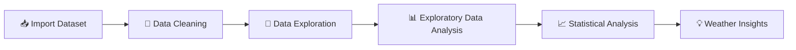

<div align="center">

# 🌦️ Weather Data Analysis using Python

### 📊 Exploratory Data Analysis • Data Analytics • Weather Intelligence


<br>


---

### ⭐ Discovering Hidden Weather Patterns Through Data Analytics

</div>

---

# 📌 Overview

This project demonstrates **Exploratory Data Analysis (EDA)** on a real-world **Weather Dataset** using Python.

The notebook explores weather observations such as **temperature, humidity, wind speed, pressure, visibility, and weather conditions** to uncover trends and answer analytical questions through data exploration.

---

# 🚀 Project Architecture



---

# 📸 Project Dashboard

<p align="center">


</p>

---

# 📊 Analysis Preview

| Temperature Analysis | Weather Conditions |
|:--------------------:|:------------------:|
|  |  |

| Humidity Analysis | Wind Speed |
|:----------------:|:-----------:|
|  |  |

---

# 📂 Repository Structure

```text
Weather-Data-Analysis
│
├── weather.ipynb
├── Weather_Dataset.csv
│
├── assets/
│      weather_dashboard.png
│      temp_analysis.png
│      humidity.png
│      weather_condition.png
│      wind_speed.png
│
└── README.md
```

---

# ⚙ Tech Stack

| Tool | Purpose |
|------|---------|
| 🐍 Python | Programming Language |
| 🐼 Pandas | Data Cleaning & Analysis |
| 🔢 NumPy | Numerical Computing |
| 📓 Jupyter Notebook | Development Environment |
| 📊 Matplotlib | Data Visualization |
| 🎨 Seaborn | Statistical Graphics |

---

# ✨ Features

<div align="center">

| 📊 | Feature |
|----|---------|
| ✅ | Data Cleaning |
| ✅ | Missing Value Analysis |
| ✅ | Data Filtering |
| ✅ | Weather Condition Analysis |
| ✅ | Temperature Analysis |
| ✅ | Humidity Analysis |
| ✅ | Pressure Analysis |
| ✅ | Wind Speed Analysis |
| ✅ | Visibility Analysis |
| ✅ | Statistical Summary |

</div>

---

# 📈 Dataset Features

| 🌤 Feature | 📖 Description |
|------------|----------------|
| 🌡 Temperature | Air Temperature |
| 💦 Humidity | Relative Humidity |
| 🌬 Wind Speed | Wind Speed |
| 🌫 Visibility | Visibility Distance |
| 🌧 Weather | Weather Condition |
| 📈 Pressure | Atmospheric Pressure |
| 🌡 Dew Point | Dew Point Temperature |

---

# 📊 Workflow Progress

```text
Import Dataset        ███████████████████ 100%

Data Cleaning         ███████████████████ 100%

EDA                   ███████████████████ 100%

Analysis              ███████████████████ 100%

Documentation         ███████████████████ 100%
```

---

# 🔍 Exploratory Analysis

<details>

<summary><b>📈 Click to Explore Analysis</b></summary>

### ✔ Dataset Inspection

- Dataset Shape
- Data Types
- Missing Values
- Duplicate Values

### ✔ Data Cleaning

- Data Validation
- Missing Value Handling
- Data Formatting

### ✔ Weather Analysis

- Temperature Trends
- Humidity Distribution
- Wind Speed Analysis
- Visibility Analysis
- Pressure Analysis
- Weather Conditions

### ✔ Statistical Analysis

- Mean
- Median
- Standard Deviation
- Filtering
- Aggregation
- Grouping

</details>

---

# 📚 Libraries

```python
import pandas as pd
import numpy as np
import matplotlib.pyplot as plt
import seaborn as sns
```

---

# 💼 Skills Demonstrated

Python

🟦🟦🟦🟦🟦 100%

Pandas

🟦🟦🟦🟦🟦 100%

EDA

🟦🟦🟦🟦🟦 100%

Visualization

🟦🟦🟦🟦🟩 95%

Statistics

🟦🟦🟦🟦⬜ 90%

---

# 🚀 Future Enhancements

- 📈 Interactive Plotly Charts
- 🌍 Live Weather API Integration
- 📊 Power BI Dashboard
- 🌐 Streamlit Web Application
- 🤖 Weather Prediction using Machine Learning

---

# 🤝 Connect

<div align="center">

## 👨‍💻 Mukul Kumar

**Aspiring Data Analyst | Python Developer**

⭐ **If you found this project helpful, please give it a Star!**

</div>

---

<div align="center">

### ❤️ Thanks for Visiting
👨‍💻 Mukul Kumar
Data Analytics Enthusiast

📞 Phone: 9315005376 | 📧 Email: mukulpal2004@gmail.com

Made with 🐍 Python • 📊 Pandas • 📈 Matplotlib • 🎨 Seaborn
⭐ If this project helped you, consider giving it a star! ⭐

